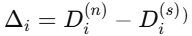
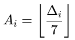
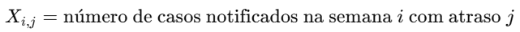
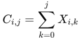
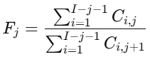
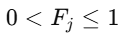
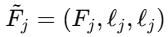
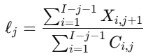
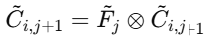
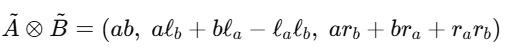

---
title: "Correção do atraso de notificação por estimadores fuzzy triangulares"
author: "delayfuzzy"
output: rmarkdown::html_vignette
vignette: >
  %\VignetteIndexEntry{Correção do atraso de notificação por estimadores fuzzy triangulares}
  %\VignetteEngine{knitr::rmarkdown}
  %\VignetteEncoding{UTF-8}
---

```{r config-geral, include=FALSE}
knitr::opts_chunk$set(
  collapse = TRUE,
  comment = "#>",
  echo = FALSE,
  fig.width = 7,
  fig.height = 5,
  out.width = "70%"
)
```

```{r carrega-pacotes, include=FALSE}
library(delayfuzzy)  # Agora funciona!
```

---

## 1. Introdução

Sistemas de vigilância epidemiológica baseados em notificação compulsória estão sujeitos a atrasos entre a ocorrência do evento de interesse e sua consolidação nos bancos oficiais. Esses atrasos comprometem a análise em tempo oportuno, especialmente durante epidemias, quando decisões de saúde pública dependem de estimativas atualizadas. O pacote delayfuzzy implementa um método para correção do atraso de notificação baseado em:

matrizes de atraso por semana epidemiológica;
estimadores de correção $F_j$;
modelagem da incerteza por números fuzzy triangulares;
propagação da incerteza ao longo do tempo.
O método foi desenvolvido para dados do SIVEP-Gripe (OpenDatasus), mas pode
ser aplicado a qualquer sistema com datas de início de sintomas e notificação.
---

## Definição do atraso de notificação

O pacote delayfuzzy implementa um método para correção do atraso de
notificação baseado em:

matrizes de atraso por semana epidemiológica;
estimadores de correção $F_j$;
modelagem da incerteza por números fuzzy triangulares;
propagação da incerteza ao longo do tempo.

O método foi desenvolvido para dados do SIVEP-Gripe (OpenDatasus), mas pode
ser aplicado a qualquer sistema com datas de início de sintomas e notificação.

Definição do atraso de notificação

Sejam:

$D^{(s)}_i$: data de início dos sintomas do caso $i$;

$D^{(n)}_i$: data de notificação do caso $i$.

Define-se o atraso de notificação em dias como:

```{r figura1, echo=FALSE, out.width="70%"}

```
O atraso em semanas epidemiológicas é obtido por:

```{r figura2, echo=FALSE, out.width="70%"}

```

No pacote, esse cálculo é realizado pela função:

```{r carrega-função1, include=FALSE}
calcular_atraso()
```

que adiciona a variável atrasoSemanas à base de dados.

## Construção da matriz de atraso

Considere:

$i = 1, \dots, 53$: semanas epidemiológicas de notificação;
$j = 0, \dots, 52$: atraso em semanas.
A matriz de atraso $X$ é definida como:

```{r figura3, echo=FALSE, out.width="70%"}

```
A matriz é construída por tabulação cruzada entre a semana epidemiológica de
notificação (SEM_NOT) e o atraso em semanas.

Apenas registros válidos são considerados:

semanas epidemiológicas entre 1 e 53;
atrasos entre 0 e 52 semanas;
ausência de valores ausentes.

Registros fora desses critérios são automaticamente excluídos, e o usuário é
informado por meio de um warning.

No pacote, essa etapa é implementada por:

```{r carrega-função2, include=FALSE}
matriz_atraso()
```

## Matriz Cumulativa de atraso

A matriz cumulativa $C$ é definida como:

```{r figura4, echo=FALSE, out.width="70%"}

```
Essa matriz representa o número acumulado de notificações até o atraso $j$,
para cada semana epidemiológica $i$.

Por construção, $C$ é uma matriz triangular inferior e não decrescente ao longo
de $j$.

No pacote, essa transformação é realizada por:

```{r carrega-função3, include=FALSE}
matriz_cumulativa()
```

## Estimador de correção do atraso

Para cada atraso $j$, define-se o estimador de correção $F_j$ como:

```{r figura5, echo=FALSE, out.width="70%"}

```

onde $I$ é o número total de semanas consideradas.

O estimador $F_j$ representa a proporção esperada de casos acumulados até o
atraso $j$, em relação ao atraso $j+1$.

Por definição, espera-se que:

```{r figura6, echo=FALSE, out.width="70%"}

```
No pacote, esse estimador é calculado pela função:

```{r carrega-função4, include=FALSE}
estimar_Fj()
```

O índice𝑗representa o atraso em semanas. Embora o banco de dados possa conter atrasos de até 52 semanas, valores específicos de𝑗podem ser analisados isoladamente para fins exploratórios ou ilustrativos. Nos exemplos deste vignette, utilizamos𝑗= 3 por corresponder a um atraso curto, típico dos fluxos operacionais de vigilância epidmeiológica. A função de alto nível do pacote estima automaticamente todos os valores de𝐹𝑗disponíveis no banco, sem necessidade de escolha manual.

## Modelagem da incerteza por números fuzzy triangulares

Para incorporar incerteza na estimativa do atraso, cada $F_j$ é representado
como um número fuzzy triangular (NFT):

```{r figura7, echo=FALSE, out.width="70%"}

```
onde:

$F_j$ é o valor central;
$\ell_j$ é a largura fuzzy, estimada a partir dos dados observados.
A largura $\ell_j$ é definida como:

```{r figura8, echo=FALSE, out.width="70%"}

```

Essa etapa é implementada no pacote pela função:

```{r carrega-função5, include=FALSE}
calc_lj()
```

## Estimação da incerteza

A previsão do valor acumulado na semana seguinte é dada por:

```{r figura9, echo=FALSE, out.width="70%"}

```
onde $\otimes$ representa a multiplicação fuzzy triangular.
Sejam:

$\tilde{A} = (a, \ell_a, r_a)$
$\tilde{B} = (b, \ell_b, r_b)$

A multiplicação fuzzy é aproximada por:

```{r figura10, echo=FALSE, out.width="70%"}

```
Essa operação é implementada pela função:

```{r carrega-função5, include=FALSE}
mult_fuzzy()
```

Embora a correção do atraso seja realizada por uma função de alto nível, o pacote disponibiliza essas funções internas que permitem explorar e compreender cada etapa do modelo. Em particular, a função mult_fuzzy() permite demonstrar, em exemplos simplificados, como a incerteza associada ao fator de correção é propagada ao longo do tempo.

A estimação temporal completa da incerteza é realizada por:

```{r carrega-função6, include=FALSE}
propagar_fuzzy()
```

que retorna:

matriz central das previsões;
matriz das laterais esquerdas;
matriz das laterais direitas.

## Função de alto nível do pacote

Para facilitar o uso por analistas e profissionais da vigilância, o pacote
disponibiliza uma função única que executa todo o pipeline metodológico:

```{r carrega-função7, include=FALSE}
estimacao_delay_fuzzy()
```

Essa função:

calcula o atraso de notificação;
constrói a matriz de atraso;
gera a matriz cumulativa;
estima $F_j$ e $\ell_j$;
propaga a incerteza fuzzy.

O retorno é uma lista contendo todas as matrizes intermediárias e finais,
permitindo inspeção completa do processo.

## Exemplo de uso

```{r carrega-função8, include=FALSE}
library(delayfuzzy)

resultado <- estimacao_delay_fuzzy(
  dados = dados,
  data_notificacao = "DT_NOTIFIC",
  data_sintomas    = "DT_SIN_PRI"
)

names(resultado)
```

## Considerações finais

O pacote delayfuzzy fornece uma implementação reprodutível e extensível
para correção do atraso de notificação em sistemas de vigilância epidemiológica,
incorporando explicitamente a incerteza inerente ao processo de notificação.

O método é particularmente útil em cenários de vigilância em tempo quase real,
onde estimativas pontuais podem ser enganosas e intervalos fuzzy oferecem uma
representação mais realista da incerteza

---
